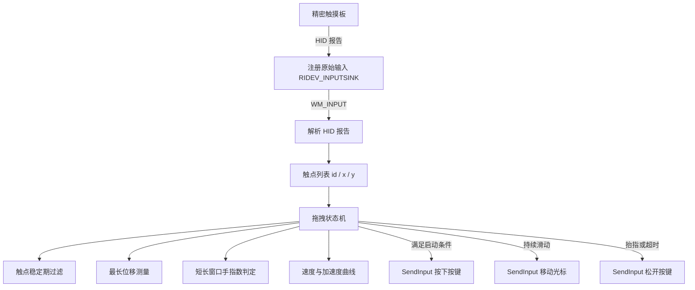
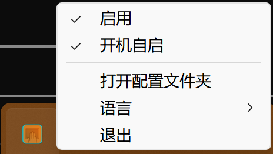
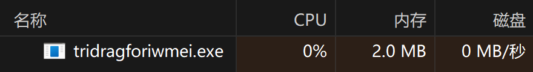

<div align="center">


# TriDragforiwmei

*为 Windows 精密触摸板补齐 macOS 式三指拖拽功能的原生超低占用托盘工具*

[English](README_EN.md) · [简体中文](README.md)

[](https://www.microsoft.com/windows)
[](src/)
[](src/)
[](LICENSE)

</div>

---

TriDragforiwmei 把 macOS 的三指拖拽手感带到 Windows 精密触摸板。三指按住并滑动即可拖动窗口或选中文本，全程无需按下物理按键。程序以无窗口托盘形态常驻，直接读取触摸板的 HID 报告识别人手势，再通过 SendInput 注入鼠标事件，常驻内存约 2 MB，单文件发布体积约 650 KB。

---

## 快速开始

如果正在使用具备终端执行能力的智能编程助手，可以直接向其发送以下指令：

```text
帮我安装这个仓库：检查 Rust 工具链，编译 TriDragforiwmei，并把生成的 exe 放到常用目录。
```

> [!TIP]
> 智能代理将自动完成工具链检查与 Release 编译，免去手动输入命令。

---

## 传统开始

### 系统要求

- 操作系统：Windows 10 或 Windows 11。
- 硬件：由 Windows 识别为精密触摸板的笔记本触摸板。
- 工具链：Rust 1.75 或更高版本。

### 方式一：从源码编译

克隆仓库后编译发布版本：

```powershell
git clone https://github.com/yourpapayouknow/TriDragforiwmei.git
cd TriDragforiwmei
cargo build --release
```

产物位于 `target\release\tridragforiwmei.exe`，双击即可运行，无需安装。

### 方式二：下载预编译版本

前往发布页面下载最新的 `tridragforiwmei.exe`，直接运行。

### 关闭系统手势

在「设置 → 蓝牙和其他设备 → 触摸板 → 三指手势」中，将三指轻扫各项全部设为「无」。若系统开启了「点按两次并拖动以多选」，也需一并关闭，否则会与三指拖拽互相干扰。

### 托盘菜单

| 菜单项 | 说明 |
|---|---|
| 启用 | 勾选时三指拖拽生效，取消后可临时停用 |
| 开机自启 | 注册登录任务，首次切换会弹出一次 UAC 提示 |
| 打开配置文件夹 | 在资源管理器中打开配置文件所在目录 |
| 语言 | 在简体中文与 English 之间切换 |
| 退出 | 保存配置并结束程序 |

---

## 功能

- 三指拖拽：三指按住触摸板滑动，自动按住鼠标按键并跟随移动，抬指即松开。
- 按键可选：拖拽期间按住的按键可选左键、右键或中键。
- 速度与加速度曲线：按设备单独调整光标速度与加速度，兼顾精准微调与快速长距离移动。
- 位移阈值可调：启动与停止阈值决定手势需滑动多远才触发拖拽，减少误触。
- 无效区过滤：可设置单帧最大位移，超过即判定为触摸板噪声并丢弃。
- 移动平均：支持多帧平均，减轻触摸板抖动带来的光标跳动。
- 双语界面：内置简体中文与英文，首次运行跟随系统界面语言，托盘菜单可即时切换。
- 开机自启：通过任务计划程序注册登录任务，以最高权限静默启动，不弹 UAC 提示。
- 高 DPI 适配：声明 Per-Monitor V2，托盘菜单按所在显示器的缩放比例清晰渲染。
- 单实例运行：具名互斥体保证同一时间只有一个实例占用触摸板。
- JSON 配置：零依赖配置文件，可直接编辑，也可从托盘菜单打开所在目录。

---

## 工作原理



手势识别采用三段判定。新出现的触点在 40 毫秒内不参与测距，避免初次接触时的坐标跳变被计为位移；短延迟与长延迟两个累计值并行维护，分别对应停止阈值与启动阈值；手势起始时记录手指数，拖拽过程中即使手指短暂离板，只要数量不变仍视为同一次拖拽。

程序创建一个隐藏的顶层窗口接收原始输入，该窗口不出现在任务栏与 Alt+Tab 中。

<div align="center">



*托盘常驻形态，右键菜单可切换启用、开机自启、语言与退出*



*任务管理器实测常驻内存约 2 MB*

</div>

> [!NOTE]
> 原始输入配合 RIDEV_INPUTSINK 标志时必须绑定真实顶层窗口，仅消息窗口收不到 WM_INPUT。因此程序使用带 WS_EX_TOOLWINDOW 与 WS_EX_NOACTIVATE 的隐藏弹出窗口，而非 HWND_MESSAGE。

---

## 配置文件

配置文件位于 `%APPDATA%\TriDragForIwmei\config.json`，首次运行时自动生成。修改后在托盘菜单中切换一次「启用」或重启程序即可生效。

```json
{
  "version": 1,
  "enabled": true,
  "button": "left",
  "allow_release_and_restart": true,
  "release_delay_ms": 500,
  "cursor_averaging": 1,
  "max_finger_move_distance": 0.0,
  "start_threshold": 100.0,
  "stop_threshold": 10.0,
  "run_elevated": false,
  "start_at_boot": false,
  "lang": "zh",
  "device_configs": {}
}
```

- `button`：拖拽期间按住的按键，取值为 `left`、`right` 或 `middle`。
- `allow_release_and_restart`：是否允许松开后重新按住继续拖拽。
- `release_delay_ms`：无新输入时释放按键前的等待时长，单位为毫秒。
- `start_threshold`：启动拖拽所需的累计位移，默认 100，调大后需要更明显的滑动才触发。
- `stop_threshold`：维持拖拽所需的最小累计位移，默认 10，调大后手指轻微停顿不会中断拖拽。
- `cursor_averaging`：光标移动的平均帧数，大于 1 时更平滑但略有延迟。
- `max_finger_move_distance`：单帧位移上限，设为 `0` 表示不限制。
- `lang`：界面语言，取值为 `zh` 或 `en`。
- `device_configs`：按触摸板分别配置，键为设备标识，值为该设备的速度与加速度。

> [!TIP]
> `cursor_speed` 默认 30，调大后光标移动更快；`cursor_acceleration` 默认 10，设为 0 可关闭加速度曲线，让光标严格按手指位移线性移动。

---

## 验证与测试

构建与静态检查：

```powershell
cargo fmt --check
cargo clippy --all-targets -- -D warnings
cargo build --release
```

功能验证：

```powershell
# 查看日志中的原始输入与拖拽状态
Get-Content "$env:APPDATA\TriDragForIwmei\tridragforiwmei.log" -Tail 30

# 确认开机自启任务已注册
schtasks /Query /TN '\TriDragForIwmei\TriDragForIwmeiStartup' /XML

# 确认触摸板被识别为精密触摸板
Get-PnpDevice -Class HIDClass | Where-Object { $_.FriendlyName -match 'Touch' }
```

---

## 致谢

手势算法思路参考自 [ThreeFingerDragOnWindows](https://github.com/ClementGre/ThreeFingerDragOnWindows)，本项目以 Rust 独立实现。
