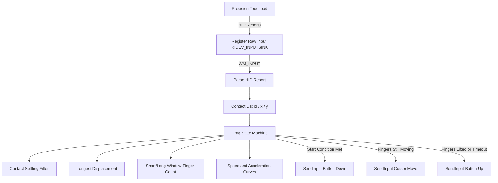

<div align="center">


# TriDragforiwmei

*Native ultra low memory tray utility that brings macOS-style three-finger dragging to Windows Precision Touchpads.*

[English](README_EN.md) · [简体中文](README.md)

[](https://www.microsoft.com/windows)
[](src/)
[](src/)
[](LICENSE)

</div>

---

TriDragforiwmei brings the macOS three-finger drag gesture to Windows Precision Touchpads. Rest three fingers on the touchpad and slide to drag a window or select text, with no physical button press required. The program runs as a windowless tray utility, reading touchpad HID reports directly to recognise the gesture and then injecting mouse events through SendInput. It idles at roughly 9 MB of resident memory and ships as a single binary of about 650 KB.

---

## Quick Start

If you are using an AI coding assistant with terminal execution capabilities, simply prompt your agent:

```text
Help me install this repository: check the Rust toolchain, build TriDragforiwmei, and place the resulting exe in a convenient directory.
```

> [!TIP]
> The AI agent will automatically verify the toolchain and produce a release build without manual step-by-step terminal input.

---

## Traditional Start

### System Requirements

- Operating System: Windows 10 or Windows 11.
- Hardware: a laptop touchpad recognised by Windows as a Precision Touchpad.
- Toolchain: Rust 1.75 or later.

### Option 1: Build from Source

Clone the repository and build the release binary:

```powershell
git clone https://github.com/yourpapayouknow/TriDragforiwmei.git
cd TriDragforiwmei
cargo build --release
```

The binary is produced at `target\release\tridragforiwmei.exe` and runs directly with no installation.

### Option 2: Download a Pre-built Release

Head to the Releases page and download the latest `tridragforiwmei.exe` to run directly.

### Disable the System Gestures

In Settings → Bluetooth & devices → Touchpad → Three-finger gestures, set every three-finger swipe to "Nothing". If "tap twice and drag to multi-select" is enabled, turn that off as well, or it will interfere with three-finger dragging.

### Tray Menu

| Menu item | Description |
|---|---|
| Enabled | Checked while three-finger dragging is active; uncheck to suspend it |
| Start at boot | Registers the logon task; the first toggle raises one UAC prompt |
| Open config folder | Opens the config directory in File Explorer |
| Language | Switches between Simplified Chinese and English |
| Quit | Saves the configuration and exits |

---

## Features

- Three-Finger Drag: Rest three fingers and slide; the mouse button is held automatically and released when the fingers lift.
- Selectable Button: Choose left, right or middle button to hold during the drag.
- Speed and Acceleration Curves: Per-device cursor speed and acceleration, balancing fine control with fast long-distance movement.
- Adjustable Thresholds: Start and stop thresholds control how far the fingers must travel before a drag begins, reducing accidental triggers.
- Dead Zone Rejection: An optional per-frame distance cap discards touchpad noise spikes.
- Cursor Averaging: Average cursor movement across frames to smooth out touchpad jitter.
- Bilingual Interface: Simplified Chinese and English built in, following the system UI language on first run and switchable from the tray menu.
- Launch at Sign-in: Registers a logon task that starts the program with highest privileges and no UAC prompt.
- High DPI Aware: Declares Per-Monitor V2 so the tray menu renders sharply at the display scale in use.
- Single Instance: A named mutex ensures only one instance drives the touchpad at a time.
- JSON Configuration: A dependency-free config file, editable by hand or via the tray menu shortcut.

---

## How It Works



Gesture recognition uses three stages. Contacts that just appeared are excluded from distance measurement for 40 ms, so the coordinate jump on initial contact is never counted as movement. A short-delay and a long-delay accumulator are maintained in parallel, mapping to the stop and start thresholds respectively. The finger count at gesture start is recorded, and if fingers briefly lift during the drag the gesture continues as long as the count returns unchanged.

The program creates a hidden top-level window to receive raw input, and that window appears in neither the taskbar nor Alt+Tab.

<div align="center">


*The resident tray icon; the context menu toggles Enabled, Start at boot, Language and Quit*


*Task Manager reads roughly 9 MB of resident memory*

</div>

> [!NOTE]
> Raw input with the RIDEV_INPUTSINK flag must target a real top-level window; a message-only window never receives WM_INPUT. The program therefore uses a hidden popup window with WS_EX_TOOLWINDOW and WS_EX_NOACTIVATE rather than HWND_MESSAGE.

---

## Configuration

The config file lives at `%APPDATA%\TriDragForIwmei\config.json` and is created on first run. After editing, toggle Enabled from the tray menu once or restart the program.

```json
{
  "version": 1,
  "enabled": true,
  "button": "left",
  "allow_release_and_restart": true,
  "release_delay_ms": 500,
  "cursor_averaging": 1,
  "max_finger_move_distance": 0.0,
  "start_threshold": 100.0,
  "stop_threshold": 10.0,
  "run_elevated": false,
  "start_at_boot": false,
  "lang": "zh",
  "device_configs": {}
}
```

- `button`: button held during the drag, one of `left`, `right` or `middle`.
- `allow_release_and_restart`: whether lifting and re-placing fingers continues the same drag.
- `release_delay_ms`: delay before releasing the button when no new input arrives, in milliseconds.
- `start_threshold`: accumulated movement needed to begin a drag, default 100; raise it to require a more deliberate slide.
- `stop_threshold`: minimum accumulated movement that keeps a drag alive, default 10; raise it so brief finger pauses do not break the drag.
- `cursor_averaging`: number of frames averaged for cursor movement; above 1 it is smoother but slightly delayed.
- `max_finger_move_distance`: per-frame displacement cap; `0` means unlimited.
- `lang`: interface language, either `zh` or `en`.
- `device_configs`: per-touchpad settings, keyed by device identifier.

> [!TIP]
> `cursor_speed` defaults to 30 and scales cursor movement directly. Set `cursor_acceleration` to 0 to disable the acceleration curve so the cursor tracks finger displacement linearly.

---

## Verification & Testing

Build and static checks:

```powershell
cargo fmt --check
cargo clippy --all-targets -- -D warnings
cargo build --release
```

Functional checks:

```powershell
# Inspect raw input and drag state in the log
Get-Content "$env:APPDATA\TriDragForIwmei\tridragforiwmei.log" -Tail 30

# Confirm the logon task is registered
schtasks /Query /TN '\TriDragForIwmei\TriDragForIwmeiStartup' /XML

# Confirm the touchpad is exposed as a Precision Touchpad
Get-PnpDevice -Class HIDClass | Where-Object { $_.FriendlyName -match 'Touch' }
```

---

## Acknowledgements

The gesture algorithm takes its inspiration from [ThreeFingerDragOnWindows](https://github.com/ClementGre/ThreeFingerDragOnWindows), implemented independently in Rust for this project.
